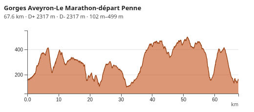

# ol-elevation-profile

<p>
  <a href="https://www.npmjs.com/package/ol-elevation-profile"></a>
  <a href="https://openlayers.org/"></a>
  <a href="https://d3js.org/">= 7"></a>
  <a href="./LICENSE"></a>
</p>

A synchronized, themeable **elevation profile control for [OpenLayers](https://openlayers.org/)**, rendered with [d3](https://d3js.org/).

It reads elevation (**Z**) directly from a track's geometry (`[lon, lat, z]` GPX/GeoJSON) — distance, ascent/descent and min/max are computed from the track itself, with no service involved. A track that carries **no** Z is filled from keyless [terrain tiles](#terrain-model), which is on by default; `dem: null` turns it off. Clicking (or hovering) a track shows its profile; a marker stays synchronized on both the map and the chart, and a click on the empty map hides it. The control is fully responsive (full-width docked bar on phones), supports slope-class colouring, metric smoothing, an A↔B crop, six themes, transparency, and a track-colour mode.

## Screenshots



> Animated demos (hover sync, A↔B crop, slope colouring) are best seen live — see the [demo](#demo). GIFs can be added under `assets/`.

## Installation

### Script tags (UMD)

The control expects `ol` and `d3` to be present as globals (provided by your map page):

```html
<link rel="stylesheet" href="https://cdn.jsdelivr.net/npm/ol@10.9.0/ol.css">
<script src="https://cdn.jsdelivr.net/npm/ol@10.9.0/dist/ol.js"></script>
<script src="https://cdn.jsdelivr.net/npm/d3@7/dist/d3.min.js"></script>

<link rel="stylesheet" href="ol-elevation-profile.css">
<script src="ol-elevation-profile.js"></script>
<!-- exposes window.OlElevationProfile -->
```

### npm / bundler (ESM)

```bash
npm i ol-elevation-profile
# ol and d3 are peer dependencies you install yourself
```

```js
import OlElevationProfile from 'ol-elevation-profile'
import 'ol-elevation-profile/css'
```

## Usage

```js
const profile = new OlElevationProfile({
  position: 'bottom',
  theme: 'steelblue',
  units: 'meters',
  color: 'auto',                              // chart uses the track colour
  trackLayer: vectorLayer,                    // layer to read that colour from
  slope: true,                                // colour the profile by gradient class
  tooltipItems: ['distance', 'elevation', 'slope'],
  titleLink: 'link'                           // title becomes a link from a feature property
})
map.addControl(profile)

const feats = new ol.format.GeoJSON().readFeatures(geojson, {
  dataProjection: 'EPSG:4326',
  featureProjection: map.getView().getProjection()
})
vectorSource.addFeatures(feats)
profile.setFeature(feats[0])  // or let a click on the track select it
```

Any OpenLayers-readable format works (GeoJSON, GPX, KML, …) — the control only consumes OL `Feature`s. Read GPX/KML with `ol.format.GPX` / `ol.format.KML` and pass the line feature to `setFeature`.

Full option reference: see the [documentation](#documentation).

## Features

### Slope classes

With `slope: true`, the profile is split into contiguous portions of the same slope class (width `slopeClassSize`, in %), capped at `maxClasses` (default 8). Colours run from **blue** (flattest class) to **red** (steepest), via cyan/green and a pure yellow, spread across the classes that are actually present (not stretched on the real maximum slope). A vertical separator marks each class change, and a legend appears under the title.

### Smoothing

`smoothing` is a sliding-window average over **metres** of track (`0` = none, the default). Because the unit is metric, the result is independent of GPS point density; it softens both the profile and the slope.

### Terrain model

A track with **no Z** — drawn by hand, traced over a basemap, exported by a tool that drops the third dimension — would get no profile. The missing elevations are read from [AWS Terrain Tiles](https://registry.opendata.aws/terrain-tiles/) instead, **by default**: PNG tiles carrying elevation in their R/G/B channels, **no API key, no quota, no rate limit**. A 10 000-point track costs a handful of tiles where a free elevation API would cost 100 requests. Pass `dem: null` to disable it and keep the control off the network.

Elevation is interpolated bilinearly between the four surrounding pixels — reading the containing pixel would make the profile advance in stairs, and every stair counts as a climb then a descent in the D+. A track is filled **entirely or not at all**: a profile missing a few points dives to sea level and its D+ becomes absurd. Tracks that already carry their own Z are untouched.

Accuracy is roughly 30–90 m depending on the region (mean 16 m from IGN's 1 m reference on steep alpine terrain). Any XYZ tile set in `terrarium` or `mapbox` encoding can be used instead. See the [guide](https://lc-4918.github.io/ol-elevation-profile/guide/features#terrain-model).

### Attributions

When the profile occupies the bottom-right corner (or full-width at the bottom), the OpenLayers attribution control is automatically lifted **above** the profile, right-aligned, with a vertical gap equal to the map-edge-to-profile-bottom gap. Other placements leave the attribution untouched.

### Time

If the track carries time data (`coordTimes` ISO timestamps from GPX `<time>`, `coordinateProperties.times`, or a 4th `M` coordinate), add `'duration'` to `headerItems` for the **total elapsed time** in the title, and `'time'` to `tooltipItems` for the **elapsed time at the cursor**. The unit adapts: `7 sec`, `26 min`, `1 h 48 min`, `2 j 3 h`. By default this is **moving time** (stopped segments below `stopSpeed`, 0.5 m/s, are excluded); set `ignoreStops: false` for raw wall-clock time. Detect availability with `OlElevationProfile.featureHasTime(feature)`.

## Demo

Live, interactive [demo](https://lc-4918.github.io/ol-elevation-profile/demo/) (toggle every option)

## Documentation

[Full guide and API](https://lc-4918.github.io/ol-elevation-profile/) (English & French)

## License

[MIT](./LICENSE) © lc-4918
